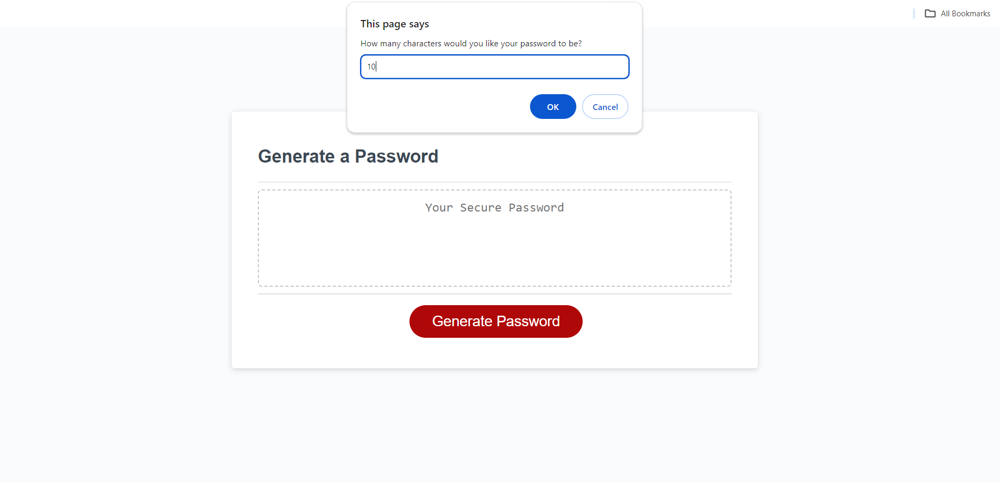
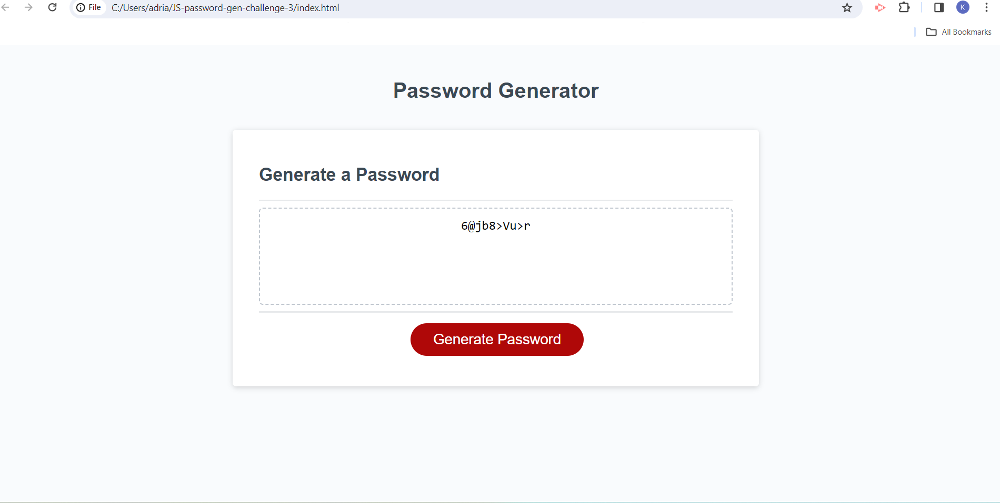

# JS-password-gen-challenge-3

## Description
Challenge #3, JavaScript Password Generator. 

My motivation was to write script that would generate a unique password using a combination of the variables aka criteria offered to and selected by the end user. 

## Usage
By writing prompt, alert and confirm code boxes we are able to offer a variety of options to choose from to generate a unique password. The user must select at least one of the options available to generaste a password or an alert will announce that it does not meet the criteria. 

Once the options have been chosen the code will generate a random password for the end user after validating the chosen criteria. This allows for the user to create a variety of password types, lengths and character sets so they will never have to repeat a password again! 

## Screenshot

## Link to finished app:
 https://katiebug23425.github.io/JS-password-gen-challenge-3/
 
## Credits

Tutor Charles Puente-Matos assisted me with debugging and code on 2/22/24 